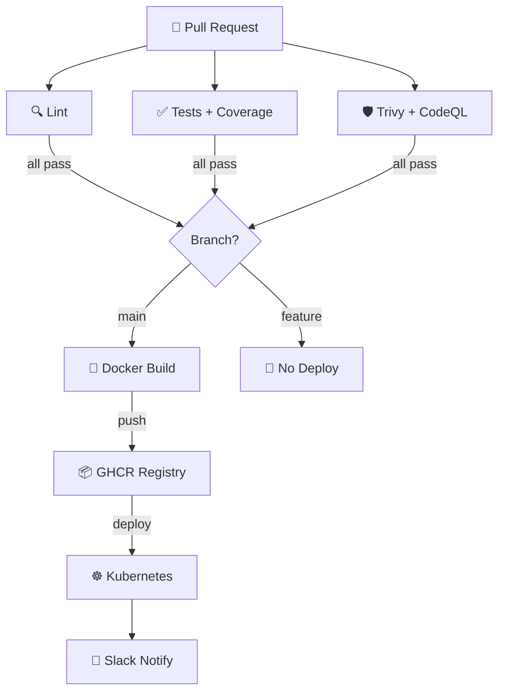

# ⚡ GitHub Actions Workflow Studio
> **Generate high-level, production-ready CI/CD pipelines with integrated Snyk/Trivy scans and secure multi-platform container pushes.**

[](https://pradeeptalari14.github.io/portfolio/tools/github-actions/)
[]()

---

## 🎛️ Studio Options — What the UI Generates

The studio has multiple configurable options. Each combination produces different output files.
This repository contains **one working example per option variant** so you can learn by diffing.

### Output Tabs (files the studio generates)
| Tab | Description |
|-----|-------------|
| `ci-cd.yml` | Generated in studio Output tab |
| `test.yml` | Generated in studio Output tab |
| `scheduled.yml` | Generated in studio Output tab |
| `release.yml` | Generated in studio Output tab |
| `Flow Diagram` | Generated in studio Output tab |

### Configurable Options
| Option | Available Values |
|--------|-----------------|
| **Language** | `Node.js` / `Python` / `Go` / `Java` |
| **Registry** | `GHCR` / `Docker Hub` / `AWS ECR` / `Azure ACR` |
| **Deploy** | `Kubernetes` / `ECS` / `App Service` / `SSH` |
| **Extras** | `Trivy Scan` / `CodeQL SAST` / `Dependabot` / `Slack notify` |

---

## 🏗️ Architecture Flow Diagram



---

## 📁 Repository Structure

```
tp-github-actions/
├── README.md          ← This file — complete learning guide
├── .github/workflows/ci-cd.yml
├── .github/workflows/scheduled.yml
├── .github/dependabot.yml
├── scripts/           ← Deployment + validation helpers
└── docs/USAGE.md      ← Extended usage guide
```

---

## ⚡ Quick Start

### Step 1 — Generate files from the Studio
1. Open **[GitHub Actions Workflow Studio Studio](https://pradeeptalari14.github.io/portfolio/tools/github-actions/)**
2. Select your option values in the UI
3. Watch the output update live in the editor
4. Click **Download** or **Copy** for each tab

### Step 2 — Use the example files in this repo
```bash
git clone https://github.com/Pradeeptalari14/tp-github-actions.git
cd tp-github-actions
# Browse examples/ to find the variant matching your needs
# Copy the relevant files into your project
```

---

## 🔄 Complete Start-to-End Workflow


---

## 📖 How Each Option Changes the Output

### Language
- **`Node.js`** — see `examples/` folder for generated output
- **`Python`** — see `examples/` folder for generated output
- **`Go`** — see `examples/` folder for generated output
- **`Java`** — see `examples/` folder for generated output

### Registry
- **`GHCR`** — see `examples/` folder for generated output
- **`Docker Hub`** — see `examples/` folder for generated output
- **`AWS ECR`** — see `examples/` folder for generated output
- **`Azure ACR`** — see `examples/` folder for generated output

### Deploy
- **`Kubernetes`** — see `examples/` folder for generated output
- **`ECS`** — see `examples/` folder for generated output
- **`App Service`** — see `examples/` folder for generated output
- **`SSH`** — see `examples/` folder for generated output

### Extras
- **`Trivy Scan`** — see `examples/` folder for generated output
- **`CodeQL SAST`** — see `examples/` folder for generated output
- **`Dependabot`** — see `examples/` folder for generated output
- **`Slack notify`** — see `examples/` folder for generated output

---

## 🔐 Security Best Practices

- ❌ Never commit credentials, API keys, or passwords
- ✅ Use environment variables or secret managers (Vault, AWS SSM, GitHub Secrets)
- ✅ Enable branch protection: require PR reviews + CI status checks
- ✅ Rotate credentials regularly and use least-privilege

---

## 📖 Resources

| Resource | Link |
|----------|------|
| Interactive Studio | [Open →](https://pradeeptalari14.github.io/portfolio/tools/github-actions/) |
| All 91 Studios | [Dashboard →](https://pradeeptalari14.github.io/portfolio/tools/) |
| SRE Provisioning Guide | [Handbook →](https://github.com/Pradeeptalari14/portfolio/blob/main/GITHUB_PROVISIONING_GUIDE.md) |

---
*Generated by [GitHub Actions Workflow Studio Studio](https://pradeeptalari14.github.io/portfolio/tools/github-actions/) — [Talari Pradeep Portfolio](https://pradeeptalari14.github.io/portfolio)*